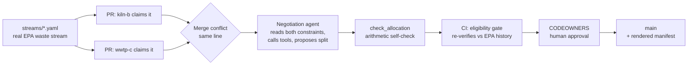

# Symbiosis Ledger

> **Two facilities claim the same truckload of hazardous waste. Git finds the
> conflict. An AI agent negotiates the split. CI and a human decide whether it
> merges.**

Built for **Bit N Build 2026** — *Supply Chain Circularity & Industrial Symbiosis*.

**Demo video:** *link coming soon*

---

## The problem, in one number

We pulled **8,004 real rows** of the EPA's hazardous-waste Biennial Report and
ran every one through the same eligibility rule our CI gate uses.

> **6,839 shipments — 13,851 tons — went to landfill or incineration even
> though a single facility in the same dataset had a recorded history of
> *recovering* every waste code on that shipment.**

That's **96.4%** of the disposal-bound rows in the sample. The capacity to
recover this waste already exists. What's missing is coordination: a way for a
recovery facility to claim a stream, for competing claims to be settled fairly,
and for everyone to trust the result.

Reproduce the number offline, no API key:
`python agents/corpus_scan.py --offline` → [`data/corpus_summary.json`](data/corpus_summary.json)

## The idea

**Make the waste exchange a git repository.**

| Real world | In Symbiosis Ledger |
|---|---|
| A waste stream up for grabs | A YAML file in `streams/`, built from real EPA data |
| A facility claiming it | A **pull request** against that file |
| Two facilities wanting the same stream | A real **git merge conflict** on the same line |
| "Is this facility allowed to take it?" | A **required CI check** against real EPA receipt history |
| Settling who gets how much | An **AI negotiation agent** reading each side's constraints |
| The receiving facility signing off | A **CODEOWNERS-required human review** |
| The shipping paperwork | A rendered **EPA Form 8700-22–shaped manifest** |

Git already gives us everything a trustworthy ledger needs — an immutable
history, conflict detection, required reviews, and blame. We didn't build a
blockchain or a dashboard. We used the audit machinery engineers already trust.



## Why this genuinely needs an agent

Matching waste to an eligible facility is a **database lookup** — so we made it
one (`agents/eligibility_check.py`) and run it as a CI check, not as AI.

What a lookup *can't* do is settle a dispute between two eligible facilities
who describe their limits in plain language:

> **kiln-b:** *"can take up to 90 tons total across the quarter, but only in
> 45-ton truckloads spaced two weeks apart"*
>
> **wwtp-c:** *"can accept any quantity as a one-time delivery, but needs at
> least 150 tons to justify the pickup"*

No `WHERE` clause compares those. Resolving them means extracting quantities
and schedules from free text, noticing when constraints can't all be met,
producing a concrete split, and **saying honestly when a full split is
impossible**. That is exactly where AI earns its place — and everything
around it is engineered to verify what the agent produces.

## Agentic AI, criterion by criterion

| Judging term | Where it lives in the code |
|---|---|
| **Agents** | Negotiation agent (`agents/negotiation_agent.py`), planner agent (`agents/planner.py`), orchestration layer (`agents/orchestrate.py`) |
| **Reasoning** | The agent turns two free-text constraints into a numeric split — or a named shortfall when no full split exists |
| **Tools** | A real function-calling loop on Gemini: `lookup_receipt_history` (checks EPA filings itself), `get_receiver_profile` (reads memory), `check_allocation` (verifies its own arithmetic before answering) |
| **Planning** | The planner ranks every eligible receiver by real receipt history, proposes in order, and **replans on denial** |
| **Memory** | Per-receiver profiles in `receivers/profiles/*.json`, committed to git. A rejected receiver is skipped on the next run, with the rejection date cited |
| **Multi-step workflows** | PR → conflict → negotiation → tool calls → self-check → CI gate → human review → merge → manifest |

Two negotiation protocols are implemented and compared on real data:

| Protocol | How it works | kiln-b | wwtp-c | Unclaimed |
|---|---|---|---|---|
| `negotiate()` | One call sees both sides | 20.0 t | 28.0135 t | 0 |
| `negotiate_blind()` | Two independent calls, each blind to the other's identity and constraint; one revision round told only the numeric shortfall | 20.0 t | 25.0 t | 3.0135 t |

Facilities choose their privacy level: the blind protocol keeps each side's
constraints fully private, while the shared protocol maximizes the tonnage
allocated. Both runs are logged verbatim in [`logs/negotiation-compare/`](logs/negotiation-compare/).

## Trustworthy by construction

An agent allocating hazardous waste should earn trust, not assume it. Five
independent layers verify every result:

1. **The agent checks its own work.** It calls `check_allocation` on its
   proposed split before committing to an answer.
2. **CI re-verifies eligibility independently.** A required GitHub Actions
   check (`.github/workflows/eligibility-check.yml`) tests every claimant
   against committed EPA data. [PR #3](https://github.com/abhijay-jindal-604/symbiosis-ledger/pull/3)
   shows it denying a real facility with zero recovery history — a genuine red ✗.
3. **The agent can't merge its own work.** Branch protection requires a
   CODEOWNERS review, and admin bypass is disabled — even the repo owner
   cannot merge an agent's resolution without a second person approving.
4. **Prompt injection is contained.** Each claimant writes their own constraint
   text, so it's treated as hostile: wrapped in `<<<UNTRUSTED_CONSTRAINT>>>`
   delimiters, and backed by arithmetic validation that holds *even if the model
   is fooled*. `tests/test_injection.py` simulates an already-fooled model.
5. **Every failure is labeled, never hidden.** Outcomes use a controlled
   vocabulary, so the repo can't overstate what produced a result:

   | `status` | Meaning |
   |---|---|
   | `RESOLVED_SPLIT` | Agent found a split satisfying both constraints |
   | `RESOLVED_PARTIAL` | No full split possible; agent gave the largest valid allocation and named the shortfall |
   | `RESOLVED_EVEN_SPLIT_FALLBACK` | The model failed after retry; a plain arithmetic split, labeled as *not* reasoning |
   | `UNRESOLVED` | Even the fallback couldn't produce a valid allocation |

**Scored, not asserted.** `demo/run_eval.py` runs 31 fixtures — malformed
model output, impossible splits, and prompt-injection attempts — through the
real negotiation code path:

> **18 valid allocations · 13 labeled fallbacks · 0 silently wrong**
> ([`out/eval_report.json`](out/eval_report.json))

**Recoverable when something slips through.** Every resolution is exactly one
commit, so a bad split is found with `git bisect` in log₂(n) steps.
`agents/check_allocation.sh` is a ready-made bisect predicate; on the
`demo/bisect-history` branch it correctly names the seeded bad commit
(`d714804`). The corrupt commit never touches `main`.

## Try it in five minutes

No API key and no network needed for any of these except `live_query.py`.

```bash
git clone https://github.com/abhijay-jindal-604/symbiosis-ledger.git
cd symbiosis-ledger
pip install -r requirements.txt

# 1. The test suite (104 tests)
pytest

# 2. Prove the data is real: re-pull the demo row live from EPA and diff it
python demo/live_query.py
#    -> MATCH

# 3. Watch the eligibility gate deny a facility with no recovery history
python agents/eligibility_check.py --claimant recycler-d \
  --stream streams/AK8570028649-D009-W301-2001.yaml
#    -> ELIGIBILITY DENIED — receiver NED981723513 has 0 recorded receipts ...

# 4. Memory: run 1 denies and records recycler-d; run 2 skips it from memory
python demo/rerun_with_memory.py

# 5. Score the agent against adversarial fixtures
python demo/run_eval.py

# 6. See the whole system in one page (static, no backend, no build step)
cd web && python -m http.server
#    -> http://localhost:8000
```

**Want to run the agent yourself?** [PR #19](https://github.com/abhijay-jindal-604/symbiosis-ledger/pull/19)
is a real, unresolved merge conflict we deliberately left open for judges.
Add a `GEMINI_API_KEY` to `.env`, then:

```bash
python demo/run_negotiation.py \
  --stream streams/AKD000850701-D001D018-W310-2007.yaml \
  --base-branch claim/kiln-b-north-pole \
  --other-branch claim/wwtp-c-north-pole
```

Every committed resolution is fully auditable: its verbatim prompt, raw model
response, and tool calls are in `logs/negotiation/`, and any fresh run passes
through the same verification gates.

## Real outcomes, real evidence

All three demo streams are real EPA-published generators and receivers.

| Stream | Generator | What happened | Evidence |
|---|---|---|---|
| **1** | USAF Elmendorf AFB, AK — 24.1325 t metals-contaminated soil (D004–D009) | **`RESOLVED_PARTIAL`.** kiln-b needs 15 t/week continuously; wwtp-c's one-time batch can't provide that. The agent gave the full batch to wwtp-c and named kiln-b's shortfall rather than inventing a split. | PRs [#1](https://github.com/abhijay-jindal-604/symbiosis-ledger/pull/1) / [#2](https://github.com/abhijay-jindal-604/symbiosis-ledger/pull/2) · commit `197ea9a` · [manifest](out/manifest-AK8570028649-D009-W301-2001.html) |
| **2** | Chemical Waste Management, Emelle AL — 48.0135 t D009 | **`RESOLVED_SPLIT`**, 20 t / 28.0135 t, by the tool-calling agent. It read both memory profiles, then verified its own split summed exactly before answering. | PRs [#9](https://github.com/abhijay-jindal-604/symbiosis-ledger/pull/9) / [#10](https://github.com/abhijay-jindal-604/symbiosis-ledger/pull/10) · commit `3c0c9a1` · two manifests (one per shipment) |
| **3** | Flint Hills Resources, North Pole AK — 201.834 t D001/D018 | **Open conflict, left for you.** Kiln-B wants 45-ton loads; WWTP-C needs ≥150 t in one pickup. | PRs [#18](https://github.com/abhijay-jindal-604/symbiosis-ledger/pull/18) (merged) / [#19](https://github.com/abhijay-jindal-604/symbiosis-ledger/pull/19) (open) |
| Denial | recycler-d vs stream 1 | **CI red ✗** — no recovery history for D009. Never merged, on purpose. | PR [#3](https://github.com/abhijay-jindal-604/symbiosis-ledger/pull/3) |

## Architecture

```
streams/            one YAML file per real EPA waste stream (the ledger)
receivers/profiles/ per-receiver memory, committed JSON
data/               committed EPA snapshot + 8,004-row corpus cache
agents/
  eligibility_check.py    deterministic EPA-history gate (runs in CI)
  negotiation_agent.py    tool-calling negotiator: negotiate() + negotiate_blind()
  llm_gemini.py           Gemini function-calling client, with labeled demo cache
  planner.py              ranks receivers, replans on denial
  orchestrate.py          memory-aware proposal layer
  validate_allocation.py  pure arithmetic validator (the backstop)
  check_allocation.sh     git bisect predicate
  manifest_render.py      EPA Form 8700-22–shaped HTML manifests
  corpus_scan.py          the corpus-scale impact number
  export_viewer_data.py   builds web/data.json from committed state
demo/               runnable scripts for every claim in this README
web/                static single-page viewer
tests/              104 tests, including prompt-injection fixtures
```

**Stack:** Python · Gemini (function calling) · GitHub Actions · CODEOWNERS
& branch protection · EPA Envirofacts API · plain HTML/JS.

## Where this goes next

- **A read-only interface for compliance officers** over the same commits —
  nobody at a facility should need to open a git client.
- **Permit data** as a second eligibility signal where states publish it.
- **Signed commits per facility**, so every merge is a cryptographically
  attributable acceptance.
- **Capacity and logistics constraints** as structured fields, leaving the
  agent to handle only what genuinely is free text.

## Design decisions

- **Safe by design with real data.** Every facility on screen is a real,
  public EPA record, and every manifest is generated locally and clearly
  captioned as a demonstration — nothing is ever transmitted to a real party.
- **Eligibility grounded in evidence.** The gate checks each facility's
  *actual recorded history* of recovering the same waste code, straight from
  federal filings, and its verdict states exactly what it checked.
- **A conservative headline number.** We lead with the strict full-profile
  count (one facility covers every code on a shipment) rather than the larger
  any-code figure (7,068 rows). Both are in `data/corpus_summary.json`, and
  both measure eligibility — the first step before capacity and logistics.
- **Reliable, reproducible CI.** CI reads a committed EPA snapshot, so every
  run is deterministic and fast, while `demo/live_query.py` confirms the
  snapshot matches the live federal data.
- **Git identities as facilities.** Each facility acts through its own GitHub
  identity, so claims, approvals, and merges carry real attribution —
  exactly the model signed commits extend to production.
- **A viewer that can't drift from the truth.** The web page renders directly
  from committed repo state, so what you see is always what's in the ledger.

<details>
<summary><strong>Engineering notes: hardening against the live Gemini API</strong></summary>

Solved by running the system end to end against the real API.

- **Gemini `thought_signature`.** Gemini 3.5 requires an opaque signature to be
  echoed back on a reconstructed function-call turn. The SDK's own examples
  never reconstruct turns, so they never hit it. It's also raw bytes, which
  crashed `json.dump` in our cache until we base64-encoded it.
- **`role="tool"` is rejected by newer models.** The python-genai docs wrap
  function responses in `Content(role="tool")`; `gemini-3.5-flash` accepts
  that, but 3.6–3.8 reject it outright. We use `"user"`, which all accept.
- **`-lite` models reject `thinking_config`** with a bare 400. The client
  skips that key for any lite model.
- **A 2-way split needs two manifests.** One EPA manifest is one shipment to
  one facility; the renderer originally dropped every recipient but the
  first. It now writes one manifest per allocated claimant.
- **Rate-limit resilience.** The free tier's 5 requests/minute needed genuine
  backoff for multi-tool negotiations. Demo scripts fall back to an on-disk
  cache on any failure, and every cached reply is printed as
  `[cached response, live-verified <date>]` — if we replay, we say so.
- **Bisect must not lie.** `validate_allocation.py` distinguishes a genuinely
  bad allocation (exit 1) from an untestable commit (exit ≥2, mapped to
  bisect's skip code 125), so a commit that predates a stream file is never
  misreported as the culprit.

</details>

<details>
<summary><strong>Data provenance</strong></summary>

`data/br_reporting_snapshot.json` was pulled on 2026-09-12 from
`https://data.epa.gov/efservice/BR_REPORTING/rows/{start}:{end}/JSON`. It holds
the rows for all three demo generators and their receivers; the third
stream's rows came verbatim from the 8,004-row corpus cached in `data/corpus/`.
Facility names are reproduced exactly as EPA publishes them — including
"CHEMICAL WASTE MANGEMENT", a real typo in the federal record.

</details>

## Team

Built by **Abhijay Jindal** ([@abhijay-jindal-604](https://github.com/abhijay-jindal-604))
and **Bhaskar Kumar Arya** ([@Bhaskar-kumar-arya](https://github.com/Bhaskar-kumar-arya)).

## AI-assisted development

Parts of this codebase were written with AI assistance (Claude), used by the
team as a tool in the same way as an IDE or linter. **No AI system is a
contributor, author, or team member on this project.** Commit authorship,
`CODEOWNERS`, and git identities name only the real people on the team.

## License

Code is MIT-licensed (see [`LICENSE`](LICENSE)). EPA RCRA Biennial Report data
is US federal public domain.
